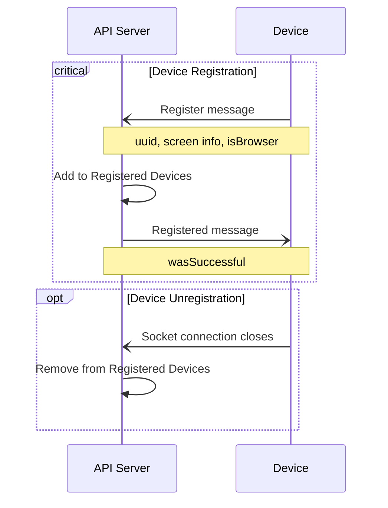
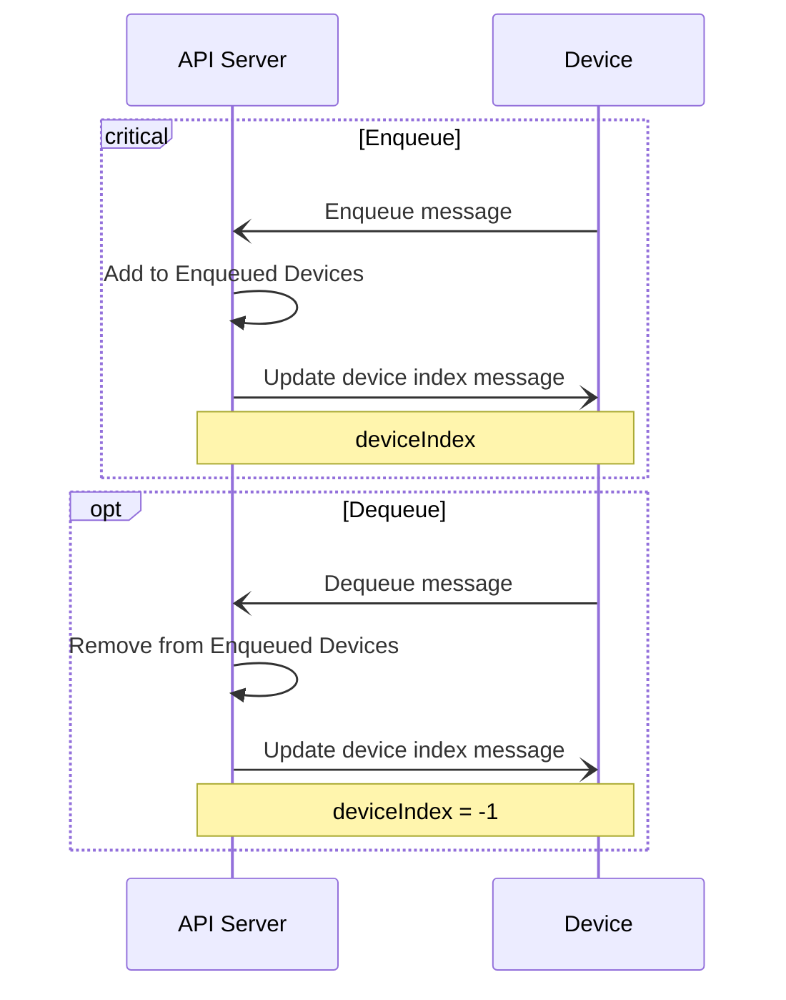
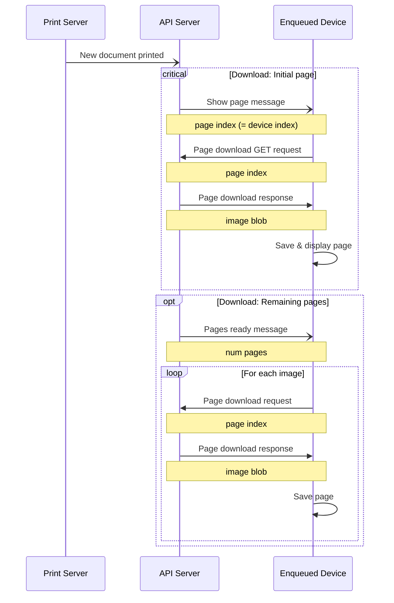
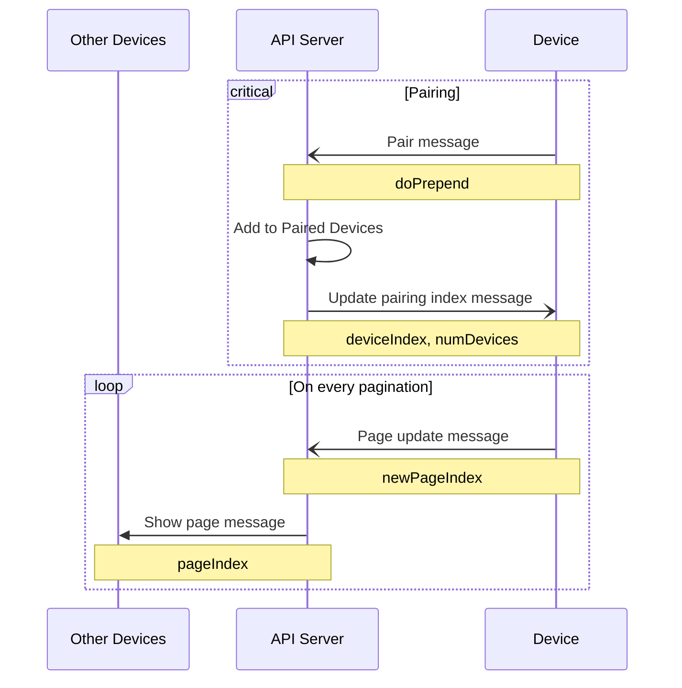

# Device - API communication

## Terms

- **Device**: Inkplate/Webbrowser (client)
- **API Server**: The server that handles the API requests
- **Print Server**: The server that handles the print requests
- **Page Chain**: An array of bitmaps, sorted by page number

## Initial registration

When a device boots/starts for the first time, it registers itself to the API Server. Registration information includes:

- uuid
- isBrowser
- screen info
  - resolution
    - width
    - height
  - color depth
  - dpi

The server ties this information to the id of the socket connection.

## Page chains

### Enqueue / Dequeue

A registered device can enqueue or dequeue itself to receive a page chain.
Enqueued devices receive a message once a new page chain is available.

### Requesting new page chains

A document can only be printed, if **at least one device is [enqueued](#enqueue--dequeue)**. Otherwise, the printing dialogue will return an error.

## Device pairing

Multiple devices can be paired together to synchronize pagination.
The current implementation only supports prepending or appending devices to one another.

