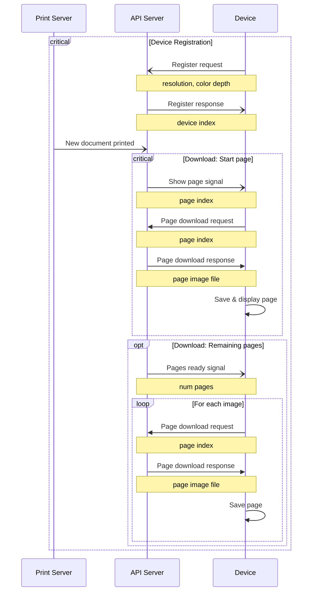
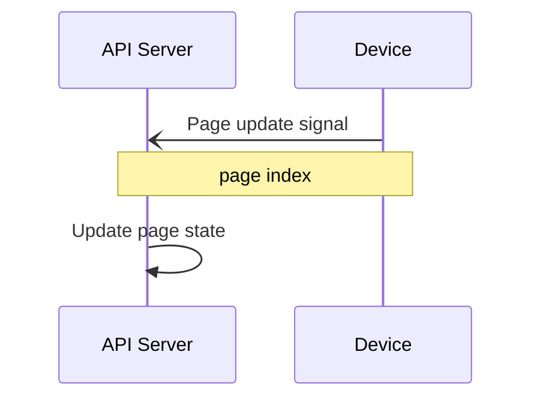
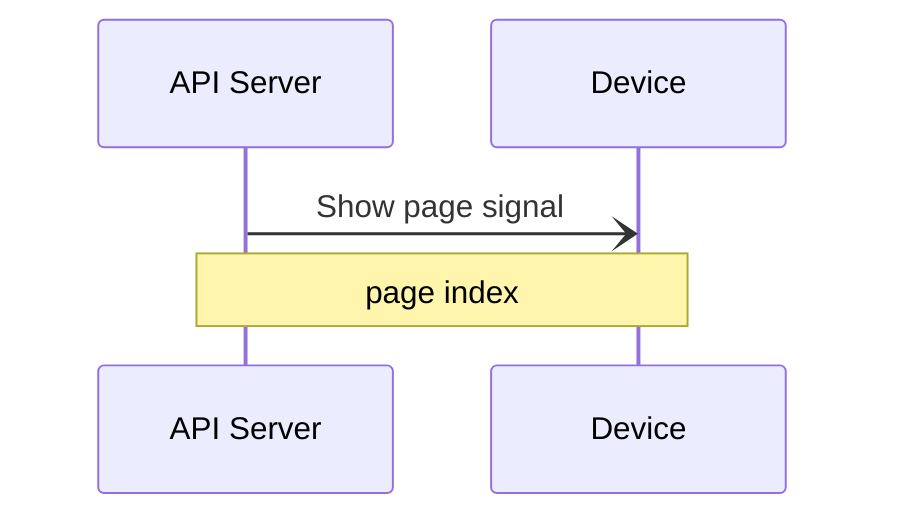

# Device - API communication

## 1.0 Single device mode

First to implement. One document per device.

### Request new page chains

## 2.0 Multi device mode

Second to implement. One document can be printed on multiple devices.

Like single device mode, but the API server can buffer multiple device registrations and page chains.

## 3.0 Paired devices

Last to implement. Multiple devices can be paired to print one document. Navigation between pages is synchronized.

### Page update

Called when a next/previous page button is clicked on the device.

### Show page

Called when a device should show another page.

