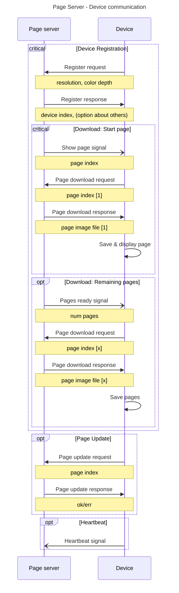

# Device - Page Server communication

```mermaid
sequenceDiagram
    title: Page Server - Device communication

    participant S as Page server
    participant D as Device

    %% ->>: synchronous
    %% -): asynchronous

    critical Device Registration
        D ->> S: Register request
        Note over S,D: resolution, color depth
        S ->> D: Register response
        Note over S,D: device index, (option about others)


        critical Download: Start page
            S -) D: Show page signal
            Note over S,D: page index
            D ->> S: Page download request
            Note over S,D: page index [1]
            S ->> D: Page download response
            Note over S,D: page image file [1]
            D ->> D: Save & display page
        end

        opt Download: Remaining pages
            S -) D: Pages ready signal
            Note over S,D: num pages
            D ->> S: Page download request
            Note over S,D: page index [x]
            S ->> D: Page download response
            Note over S,D: page image file [x]
            D ->> D: Save pages
        end

    end

    opt Page Update
        D ->> S: Page update request
        Note over S,D: page index

        S ->> D: Page update response
        Note over S,D: ok/err
    end

    %% Maybe not necessary?
    opt Heartbeat
        D -) S: Heartbeat signal
    end
```
